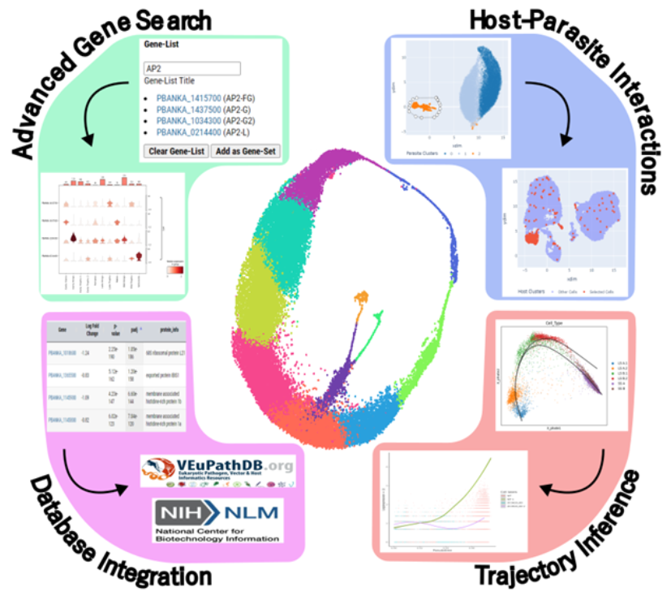

# paraCell: A novel software tool for the interactive analysis and visualization of standard and dual host-parasite scRNA-seq data

<!-- Adapted from Abstract -->
Advances in sequencing technology have led to a dramatic increase in the number of single-cell transcriptomic datasets available. In the field of parasitology these datasets typically describe the gene expression patterns of a given parasite species under specific experimental conditions, in specific hosts or tissues, or at different life-cycle stages. However, while this wealth of available data represents a significant resource for further research, the analysis of these datasets often requires significant computational skills, preventing a considerable proportion of the parasitology community from meaningfully incorporating existing single-cell data into their work. Here we present **paraCell**, a novel software tool that automates the advanced analysis of published single-cell data without requiring any programming ability. paraCell builds on the core functionality of [cellxgene](https://github.com/chanzuckerberg/cellxgene) and [cellxgene VIP](https://github.com/interactivereport/cellxgene_VIP) to offer additional analysis features of value to parasitologists (see Figure 1). The software is freely available for the community for local use, and various [published datasets](http://cellatlas.mvls.gla.ac.uk/) offer examples of what paraCell can achieve.
<!-- and we demonstrate the efficacy of the tool demonstrated in four use-cases, in which paraCell is used to visualize data, re-analyse published Plasmodium and Trypanosoma datasets, and to generate the first dual scRNA-seq Theileria-Cow cell atlas, interrogating the susceptibility of different cattle breeds  to the Theileria parasite. -->



**Figure 1 | Overview of the four main options in paraCell.** **_Advanced Gene Search_** - a custom gene-set is used to create a cellxgene VIP multi-gene violin plot (_Plasmodium berghei_ dataset). **_Host-Parasite Interactions_** - selection made on the Parasite UMAP is used to update the Host UMAP (Cow-_Theileria_ dataset). **_Database Integration_** - paraCell results table is shown alongside links to relevant external database systems (_P. berghei_ dataset). **_Trajectory Inference_** - [Slingshot](https://bioconductor.org/packages/devel/bioc/vignettes/slingshot/inst/doc/vignette.html) trajectories drawn over [PHATE](https://phate.readthedocs.io/en/stable/) space of single-cell data, enables [tradeSeq](https://bioconductor.org/packages/release/bioc/html/tradeSeq.html) to plot expression of genes over their “pseudo time” for different conditions - example relates the expression of the gene PAD2 to the progression of both trajectories in the WT and KO condition (_Trypanosoma brucei_ dataset).

## Demo datasets:
- **_Plasmodium berghei_** - https://cellatlas-cxg.mvls.gla.ac.uk/view/Pb.Combined.h5ad/
- **_Trypanosoma brucei_** - https://cellatlas-cxg.mvls.gla.ac.uk/view/Tbrucei.h5ad/

## Online tutorial:
- **paraCell features** - https://github.com/sii-cell-atlas/paraCell/wiki
- **Core VIP functionality** - https://interactivereport.github.io/cellxgene_VIP/tutorial/docs

# Installation instruction

## 1. Install miniconda if not available on server (https://docs.conda.io/projects/conda/en/latest/user-guide/install/linux.html)
``` bash
bash ~/Downloads/Miniconda3-latest-Linux-x86_64.sh
conda install mamba -n base -c conda-forge
```

## 2. Create and enable conda environment
``` bash
git clone https://github.com/sii-cell-atlas/paraCell.git
cd paraCell

source <path to Miniconda3>/etc/profile.d/conda.sh 
conda config --set channel_priority flexible
mamba env create -n <env name, such as: paraCell> -f paraCell_conda_R.yml (local R under conda, no root privilege needed)

For Mac User, conda env create -n <env name, such as: paraCell> -f paraCell.macOS.yml

mamba env update -f r_dependencies.yml --name paraCell

conda activate <env name, such as: paraCell>
or
source activate <env name>
```
## 3. Install cellxgene by running config.sh in "paraCell" directory
```bash
./config.sh
For Mac User, ./config.macOS.sh
```
## 4. Run cellxgene by specifiying a h5ad file storing scRNA-seq data along with a host and a port, use "ps" to find used ports to spare, see https://chanzuckerberg.github.io/cellxgene/posts/launch for details.
```bash
ps -ef | grep cellxgene
Rscript -e 'reticulate::py_config()'
# Run the following command if the output of the above command doesn't point to the Python in your env.
export RETICULATE_PYTHON=`which python`
cellxgene launch --host <xxx> --port <xxx> --disable-annotations --verbose <h5ad file>
```
## 5. From web browser (Chrome is preferred, Version 87.0.4280.88 or 87.0.4280.141 is used), access http(s)://host:port

You should be able to see this in Console of Chrome Developer Tools if everything is right.


*note: while spinning up the cellxgene from HPC, do **NOT** use qlogin. **ssh directly to the server**.*

# Updating
```bash
./update.VIPInterface.sh all # if "interface.html" or "VIPInterface.py" is modified or new code needs to go to right location, often.

./update.index_template.sh # if jsPanel is modified, very rare.
```
