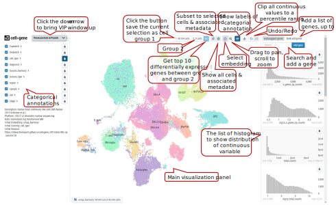
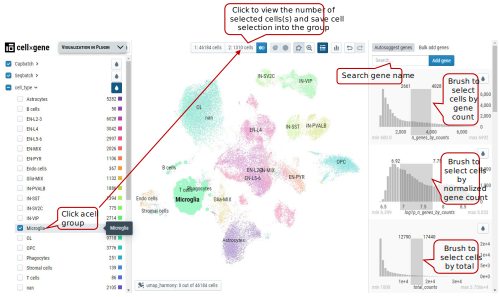
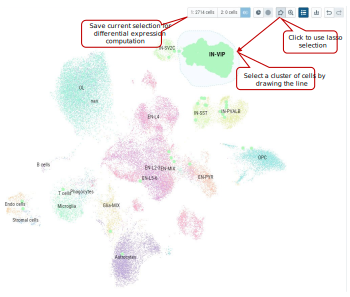
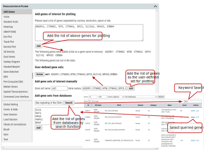
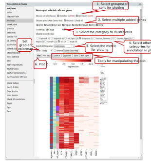
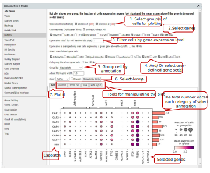
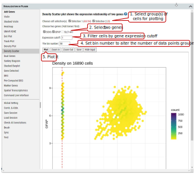
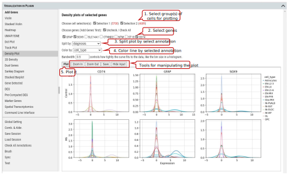
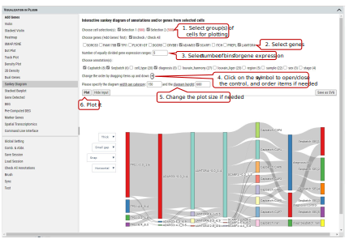
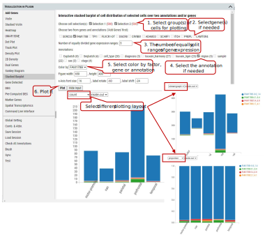

# How to use Cellxgene VIP

## Graphical user interface of cellxgene and VIP
The main window of cellxgene is divided into three regions, the left panel mainly displays categorial
annotations, brief description of the data set and initial graphics setting, specifically embedding and
coloring of cells. On the right panel, it hosts continuous variables, such as qc metrics shown in histogram
with x, y corresponding to values of a measurement and numbers of cells, respectively. More
importantly, cells shown as individual dots are presented in the center panel based on a selected
embedding and colored by either categorial annotations or continuous variables, which is indicated by
pressed rain drop icon.

## Cell	selection	by	categorial	annotations

It is an overlap operation when categories from multiple annotations are checked to make the final selection. E.g., if male from sex is also checked besides B cells, it means cells from B cells cluster of male samples are selected.
Note: Click “1:” or “2:” button to save cell selection into group 1 or 2

## Cell	selection	by brushing	on	distribution	of	continues	variables

Note: Histograms of expression values of genes can by brushed as well to get cells expressing certain genes in the range.

## Free	hand	Lasso	selection	on	dots	representing	cells
From the cell visualization panel, user can freely select a cluster of cells of interest by using ‘Lasso’ selection tool. The selected cluster of cells can also be added as a group for downstream analysis in cellxgene VIP.

Note: Please try to draw as close as possible to the starting point in the end to make an enclosed shape to ensure successfully lasso selection.

## VIP	– Figure	Option
User can set parameters for figure plotting that control plotting functions except CLI. ‘split_show’ branch of Scanpy offers better representation of Stacked Violin and Dot Plot comparing to master branch.

Scaled data have zero mean and unit variance per gene. This was performed by calculating z-scores of the expression data using Scanpy’s scale function. (Scanpy pp.scale function: Scale data to unit variance and zero mean.) 

We provide flexibility to allow 1) scale to unit variance or not; 2) Zero centered or not; 3) Capped at max value after scaling.

We recommend using scaled data for plotting/visualization while using non-scaled data for differential gene expression analysis.

Note: Dot plot is one exception in visualization category which uses non-scaled data for meaningful interpretation. 

## VIP	– Add	Genes	/	Gene	Sets
Cellxgene VIP allows user to add any genes or gene sets for extensive exploration and visualization. User can either type a list of gene in the textbox or create sets of genes to be grouped together in plots. Then the genes will be automatically listed for plotting in other functional modules after checking availability in the dataset.

Note: The cursor will turn to cross icon while hovering over a gene name, then click to delete the gene.

## VIP	– Violin	Plot

To plot expression of gene among categories of an annotation, e.g., cell type, sex, or batch etc.
Step 1. User needs to select the group(s) of cells for plotting. These groups can be created by using selection tools illustrated in tutorial section 2, 3 and/or 4. Initially, all of cells are gathered in ‘Group 1’ by default.
Step 2. Select a gene from the gene list which could be added as shown in section 6. An expression level cutoff can be set to further filter out cells with low level expression of such gene.
Step 3. Select the annotation to group cells for plotting.
Step 4. Execute plotting, get plotting data (i.e., gene expression), manipulate image (e.g., zoom in/out) or save the image. 

Note: Figure resolution and format can be set in “Figure Option” tab as shown in tutorial section 5.

## VIP	– Stacked	Violin
Beyond plotting expression values of a gene, stacked violin allows plotting of multiple genes together.

Note: If collapsing of gene sets is set to ‘Yes’, average gene expression of genes in a set is used for plotting.

## VIP	– Heatmap
To show or compare the expression level (i.e., expression value or expression Z-score) of multiple genes among the selected group of cells.

## VIP	– UMAP/tSNE
To plot the embedding of cells in the selected group(s). One of pre-computed and loaded embeddings  can be selected.

User can color cells in the embedding plots by multiple annotations (e.g., cell_type, diagnosis). 

Besides coloring cells by annotations, user can color cells based on gene expression level of selected genes in the embedding plots.

## VIP	– Dot	Plot
To show the fraction of cells (annotated by dot size) expressing a gene in each group and the averaged expression level of the gene (annotated by color intensity) in the group.

Note: The number of cells represented by side bar chart are always numbers of cells distributed in each category of certain annotation without filtering. It will give accurate estimate of number of cells in each bubble in the plot. The use of the plot is only meaningful when the counts matrix contains zeros representing no gene counts. Its visualization does not work for scaled or corrected matrices in which zero counts had been replaced by other values, see https://scanpy-tutorials.readthedocs.io/en/multiomics/visualizing-marker-genes.html#Dot-plots.

## VIP	– Track	Plot

To show the expression of gene(s) of individual cells as vertical lines grouped by the selected annotation on x-axis. Instead of a color scale, the gene expression is represented by height.

## VIP	– Density	Plot

To show the density of gene(s) expression in the cells annotated by category in the selected group(s) of cells. A density plot is a representation of the distribution of a numeric variable. It uses a kernel density estimate to show the probability density function of the variable (see more). It is a smoothed version of the histogram and is used in the same concept.

The bandwidth defines how close to a value point the distance between two points must be to influence the estimation of the density at the point. A small bandwidth only considers the closest values, so the estimation is close to the data. A large bandwidth considers more points and gives a smoother estimation.

## VIP	– Density	Scatter Plot
Besides plotting of expression density of single gene, density scatter plot allows to explore the joint expression density of two genes in the cells expressing both genes above a cutoff.

## VIP	– Dual	Genes
To view the relationship of expression levels of two genes in selected cells. It is based on the embedding plot of cells while coloring cells according to the expression levels of gene(s) in each cell.

## VIP	– Sankey	Diagram
Sankey diagram shows the flow of gene expression and annotations linked by cells. Gene expression is divided equally into bins so user can view distribution relationship between gene expression and annotations. 

The diagram is also shown in an interactive way that user can change the layout by selecting several items (e.g., thin or thick on color bar, small or large space) from the panel. Also, user can drag these small boxes on the plot to get preferred layout and save it as high resolution SVG figure. 

In addition, when you hover over mouse on a box, you can get detailed information about the source and target of flow

## VIP	– Stacked	Barplot
To show the distribution of cells among categories of an annotation and/or ranges of expression of agene. Only two factors from annotations or genes can be chosen. The plot allows user to explore the distribution of cells in different views interactively.

<!--  -->

<!--  -->

## VIP	– Gene	Detected
To show the number of genes expressed above the specified expression cut-off in the selected group(s) of cells.

## VIP	– DEG	(Differential	Expressed	Genes)
Besides plotting functions, cellxgene VIP also provides differential analysis between two selected groups of cells to identify differential expressed genes. 

Three differential analysis statistical test methods are provided including Welch’s t-test, Wilcoxon rank test and Wald’s test. The statistical test results are presented in a table format including log2 Fold change, p-value and padj value (i.e, FDR value). Please note, we provide users with simple test methods for quick exploration within the interactive framework. However, there would be covariates need to be considered in a proper statistical test. Please consult your stats experts for appropriate test by using the right test method and right model.

Volcano plotting is also provided to show the log2FC vs. -log10(FDR) relationship for all genes. User can select the gene(s) from the pre-selected gene list to be highlighted with text in the volcano plot.

<!--  -->

Note: The data used by DEG is unscaled (please refer to description of the dataset to find out what preprocessing was done on the data). Scaling control in the Figure Option does not apply to DEG. The three methods: ‘Welch’s t-test’ uses t-test (assuming underlining data with normal distributions) this uses cellxgene t-test implementation, ‘Wilcoxon rank test’ uses Wilcoxon rank-sum test (does not assume known distributions, non-parametric test) and ‘Wald’s test’ uses Wald Chi-Squared test which is based on maximum likelihood. ‘Wilcoxon rank test’ and ‘Wald’s test’ use diffxpy’s implementation.

## VIP - Pre-computed DEG

In addition, cellxgene VIP shows the differential analysis within some pre-computed annotated groups.

## VIP	– Marker	Genes
This functional module allows user to identify marker genes in the selected group(s) (more than 2, if 2 groups, please use DEG) of cells by annotation categories.

Four methods are provided for detecting marker genes including logreg, t-test, Wilcoxon, and t-testoverest_var. For each identified marker gene, the gene name, scores (the z-score underlying the computation of a p-value for each gene for each group) and assigned group are listed in the output table.

In each annotation category, top ranked marker genes (this example shows top 2) will be plotted by score in comparison to the rest of the categories.

<!--  -->

Note: The four methods implementations by calling scanpy.tl.rank_genes_groups function: 'logreg' uses logistic regression, 't-test' uses t-test, 'wilcoxon' uses Wilcoxon rank-sum, and ‘t-test_overestim_var’ overestimates variance of each group.

## VIP	– Command	Line	Interface
Although cellxgene VIP provides a rich set of visualization modules as shown above, command line interface is also built to allow unlimited visualization and analytical capabilities by power user who know how to program in Python / R languages. 

Note: In CLI the AnnData (adata) object is available by default, and it is processed as ‘Description’ of the dataset states (i.e.: normalized and log transformed, but no scaled etc.). Settings in ‘Figure Option’ tab won’t apply to CLI.

##  VIP	– Comb.	&	Abbr.

User can combine multiple annotations to create combinatorial annotation to group cells in various of plotting, e.g., stacked violin and dot plot. Firstly, user ‘uncheck all annotations’ and, secondly go to the annotation panel in main window to select annotation categories to be combined, e.g., diagnosis (Control and MS) combined with sex (female and male). After clicking on ‘Create’ button, all possible combinatorial names will be listed and ‘Custom_combine’ will be automatically available as an option in ‘Group by’ drop down menu of many plotting functions.

User can also rename each annotation by creating abbreviations to shorten axis labels in figures.

## VIP	– Other	Functions

There are other convenient functions available to user, such as ‘Save’ or ‘Load’ session, ‘Check All Annotations’ and ‘Brush’.

‘Save’ or ‘Load’ session are used to save the current cell selections and parameter settings to text file or load previously saved session file in the tool for visualization.

‘Check All Annotations’ is used to check all categorical selection boxes of annotations on the left panel.

‘Brush’ is to display exactly these selected ranges from histograms of variables on the right panel in a nice table that is not available in original cellxgene.

