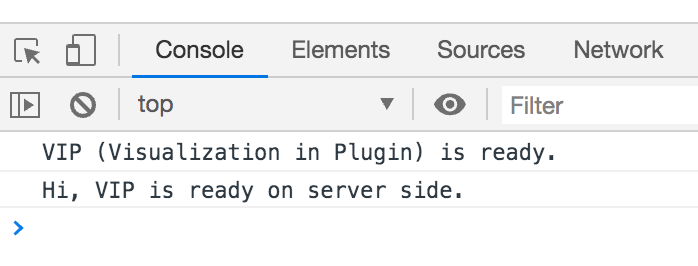

# Getting started with cellxgene VIP

This is a cellxgene VIP tutorial book written in **Markdown**. 

## Why use cellxgene VIP?
To meet the growing demands from scientists to effectively extract deep insights from single cell RNA-seq datasets, we developed cellxgene VIP, a frontend interactive visualization plugin to cellxgene framework, which directly interacts with in-memory data to generate a comprehensive set of plots in high resolution, perform advanced analysis, and make data downloadable for further analysis. It makes large scale scRNA-seq data visualization and analysis more accessible and reproducible with the potential to become an ecosystem for the scientific community to contribute even more modules to the Swiss knife of scRNA-seq data exploration tool.

## Getting Set up
### Execute anaconda
```{bash, eval=FALSE}
bash ~/Downloads/Anaconda3-2020.02-Linux-x86_64.sh
```
If anaconda is not installed on server, you can install it following anaconda documentation (https://docs.anaconda.com/anaconda/install/linux/)
### Create and enable conda environment
```{bash,eval = FALSE}
# clone repo from cellxgene VIP github
git clone https://github.com/interactivereport/cellxgene_VIP.git
cd cellxgene_VIP

# conda environment
source <path to Anaconda3>/etc/profile.d/conda.sh (Default: /opt/anaconda3/etc/profile.d/conda.sh)
conda config --set channel_priority flexible
conda env create -n <env name, such as: VIP> -f VIP.yml (system-wide R) or VIP_conda_R.yml (local R under conda, no root privilege needed)
```
Activate conda environment
```{bash,eval = FALSE}
conda activate <env name, such as: VIP>
```
or 
```{bash,eval = FALSE}
source activate <env name>
```
### Cellxgene installation
Install cellxgene by running config.sh in "cellxgene_VIP" directory
```{bash eval=FALSE}
./config.sh
```
### R dependencies
Install all required R packages on linux:
```{bash eval=FALSE}
export LIBARROW_MINIMAL=false
#  ensure that the right instance of R is used. e.g. system-wide: /bin/R or /usr/bin/R ; local R under conda: ~/.conda/envs/VIP_conda_R/bin/R
which R

R -q -e 'if(!require(devtools)) install.packages("devtools",repos = "http://cran.us.r-project.org")'
R -q -e 'if(!require(Cairo)) devtools::install_version("Cairo",version="1.5-12",repos = "http://cran.us.r-project.org")'
R -q -e 'if(!require(foreign)) devtools::install_version("foreign",version="0.8-76",repos = "http://cran.us.r-project.org")'
R -q -e 'if(!require(ggpubr)) devtools::install_version("ggpubr",version="0.3.0",repos = "http://cran.us.r-project.org")'
R -q -e 'if(!require(ggrastr)) devtools::install_version("ggrastr",version="0.1.9",repos = "http://cran.us.r-project.org")'
R -q -e 'if(!require(arrow)) devtools::install_version("arrow",version="2.0.0",repos = "http://cran.us.r-project.org")'
R -q -e 'if(!require(Seurat)) devtools::install_version("Seurat",version="3.2.3",repos = "http://cran.us.r-project.org")'
R -q -e 'if(!require(rmarkdown)) devtools::install_version("rmarkdown",version="2.5",repos = "http://cran.us.r-project.org")'
R -q -e 'if(!require(tidyverse)) devtools::install_version("tidyverse",version="1.3.0",repos = "http://cran.us.r-project.org")'
R -q -e 'if(!require(viridis)) devtools::install_version("viridis",version="0.5.1",repos = "http://cran.us.r-project.org")'
R -q -e 'if(!require(BiocManager)) devtools::install_version("BiocManager",version="1.30.10",repos = "http://cran.us.r-project.org")'
R -q -e 'if(!require(fgsea)) BiocManager::install("fgsea")'

# These should be already installed as dependencies of above packages
R -q -e 'if(!require(dbplyr)) devtools::install_version("dbplyr",version="1.0.2",repos = "http://cran.us.r-project.org")'
R -q -e 'if(!require(RColorBrewer)) devtools::install_version("RColorBrewer",version="1.1-2",repos = "http://cran.us.r-project.org")'
R -q -e 'if(!require(glue)) devtools::install_version("glue",version="1.4.2",repos = "http://cran.us.r-project.org")'
R -q -e 'if(!require(gridExtra)) devtools::install_version("gridExtra",version="2.3",repos = "http://cran.us.r-project.org")'
R -q -e 'if(!require(ggrepel)) devtools::install_version("ggrepel",version="0.8.2",repos = "http://cran.us.r-project.org")'
R -q -e 'if(!require(MASS)) devtools::install_version("MASS",version="7.3-51.6",repos = "http://cran.us.r-project.org")'
R -q -e 'if(!require(data.table)) devtools::install_version("data.table",version="1.13.0",repos = "http://cran.us.r-project.org")'
```
### Run cellxgene by h5ad file
You can aslo run cellxgene by specifying a h5ad file, which stores scRNA-seq data along with a host and a port. 
Use 'ps' to find used ports to spare. Please see <https://chanzuckerberg.github.io/cellxgene/posts/launch> for details
```{bash eval=FALSE}
ps -ef | grep cellxgene
Rscript -e 'reticulate::py_config()'
# Run the following command if the output of the above command doesn't point to the Python in your env.
export RETICULATE_PYTHON=`which python`
cellxgene launch --host <xxx> --port <xxx> --disable-annotations --verbose <h5ad file>
```
### Cellxgene on web browser
chrome is preferred, version 87.0.4280.88 or 87.0.4280.141 is used. Users can access \textbf{http(s)://host:port}.
Following screenshot is what you should be able to see in console of chrome developer tools.


## Authors
- Keijie Li (kejie.li@biogen.com), Associate Director at Biogen in the research department. Main author and content wrangler. 
- Zhengyu Ouyang, Associate Director of Bioingormatics at BioinfoRx. Content wrangler. 
- Baohong Zhang (baohong.zhang@biogen.com), Head of Genome Informatics at Biogen in the research department. Corresponding author and content wrangler.


The development and delivery of this material has also contributed by: 

- Yirui Chen (yirui.chen@bigen.com), Biogen Inc.
- Dongdong Lin (dongdong.lin@biogen.com), Biogen Inc.
- Michael Mingueneau (michael.mingueneau@bioigen.com), Biogen Inc.
- Jake Gagnon (jake.gagnon@biogen.com), Biogen Inc.
- Will Chen  (wwchen@post.harvard.edu), Biogen Inc.
- David Sexton  (david.sexton@biogen.com), Biogen Inc.

```{r include=FALSE}
# automatically create a bib database for R packages
knitr::write_bib(c(
  .packages(), 'bookdown', 'knitr', 'rmarkdown'
), 'packages.bib')
library(reticulate)
```
